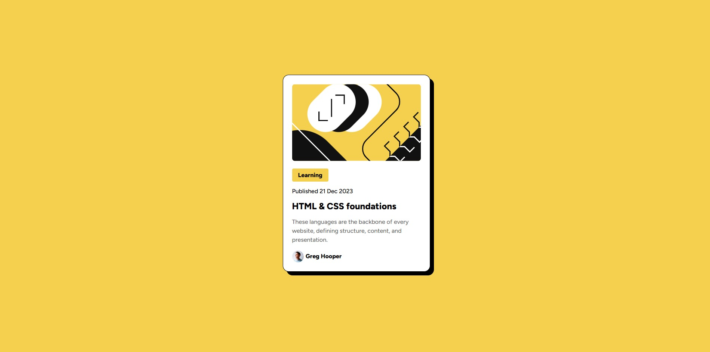

# Frontend Mentor - Blog preview card solution

This is a solution to the [Blog preview card challenge on Frontend Mentor](https://www.frontendmentor.io/challenges/blog-preview-card-ckPaj01IcS). Frontend Mentor challenges help you improve your coding skills by building realistic projects. 

## Table of contents

- [Overview](#overview)
  - [The challenge](#the-challenge)
  - [Screenshot](#screenshot)
  - [Links](#links)
- [My process](#my-process)
  - [Built with](#built-with)
  - [What I learned](#what-i-learned)
  - [Continued development](#continued-development)


## Overview

### The challenge

Users should be able to:

- See hover and focus states for all interactive elements on the page

### Screenshot




### Links

- Solution URL: https://eileen9101.github.io/Blog-Card/

## My process
I started by only looking at HTML, I mapped out my ideas using a whiteboard to define what semantic elements I should use. Once I had the HTML in a state I was happy with, I moved to CSS.

To start, I read through the MDN docs on the display property. I firgured I would need to use either display: grid or flex. After looking into the two I decided to pursue display: flex.

From there, I worked from top to bottom only moving on when I was happy with what I had done.

### Built with

- Semantic HTML5 markup
- CSS custom properties
- Flexbox


### What I learned

I learned alot about using flexboxes and am finding it helpful to use my Figma knowledge to understand how the parent/child relationships should work. For example, once I set the page to flex and set the width of my card, I had to figure out how to have the image fill the full width, which ended up being so similar to figma!

```html
 <div class="Card">
    
   ...
  </div>
```
```css
.Card_image {
      width: 100%;
      border-radius: 8px;
    }
```


### Continued development

I am going to continue trying out these exercise to sharpen my HTML and CSS, I want to next work on responsiveness.